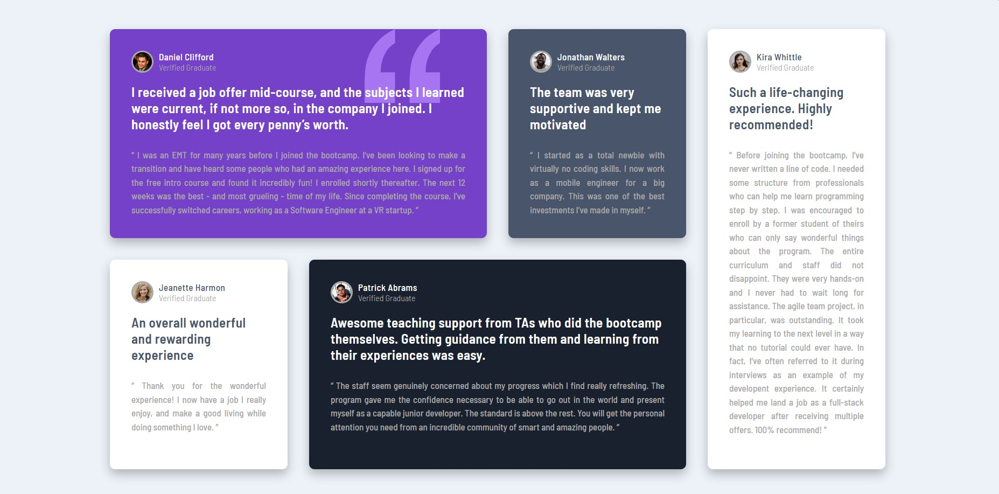
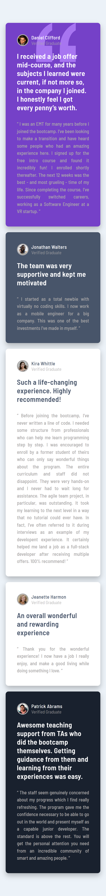

# Frontend Mentor - Testimonials grid section solution
EN
This is a solution to the [Testimonials grid section challenge on Frontend Mentor](https://www.frontendmentor.io/challenges/testimonials-grid-section-Nnw6J7Un7). Frontend Mentor challenges help you improve your coding skills by building realistic projects. 

ES
Esta es la solucion al reto [Testimonials grid section challenge on Frontend Mentor](https://www.frontendmentor.io/challenges/testimonials-grid-section-Nnw6J7Un7).

## Table of contents
## Tabla de contenidos
- [Overview/Introduccion](#overview)
  - [Screenshot/Capturas de pantalla](#screenshot)
  - [Links](#links)
- [My process/Mi proceso](#my-process)
- [Author/Autor](#author)

## Screenshot

### Links

- Solution URL: [URL](https://github.com/chefoce/testimonials-grid-section-main)
- Live Site URL: [URL](https://chefoce.github.io/testimonials-grid-section-main/)

/*Pendiente*/
## Author

- Website - [Carlos Oceguera](https://www.your-site.com)
